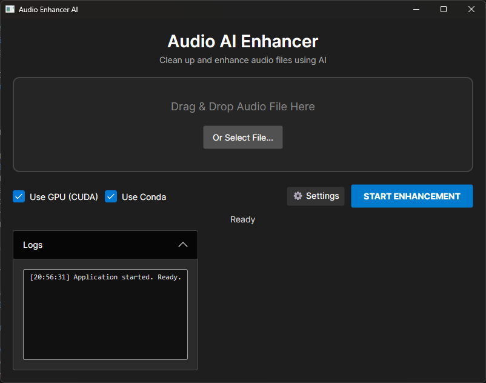
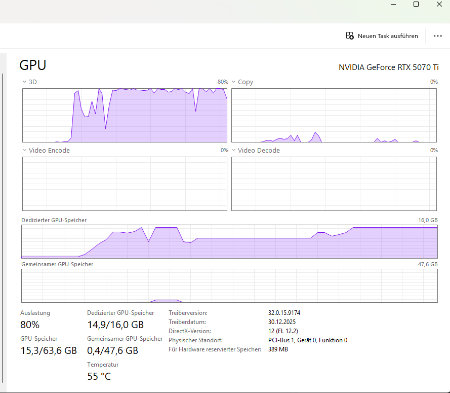

# Audio Enhancer (Standalone)

A modern, standalone desktop application to enhance audio quality using AI (AudioSR).
Built with **C# / Avalonia UI** (.NET 9.0) and **Python**.



## 🚀 Features

-   **High-Quality AI Enhancement**: Uses the `audiosr` library to upscale and restore audio.
-   **GPU Acceleration**: Fully utilizes NVIDIA GPUs (CUDA) for fast processing.
-   **Smart Chunking**: Splits large files into manageable chunks (configurable!) to prevent crashes and ensure responsive UI.
-   **Modern UI**: Dark-themed, drag-and-drop interface built with Avalonia.
-   **Memory Management**: Aggressive garbage collection preventing VRAM leaks on long files.

## 🛠 Prerequisites

To run this application, you need:

1.  **Windows OS** (Linux/macOS pending verification).
2.  **.NET 9.0 Runtime** (or SDK to build).
3.  **FFmpeg**: Installed and accessible (or path configured in Settings).
4.  **Python & Conda Environment**:
    *   You need a Conda environment (default name: `vasr-cuda13`) with `audiosr` installed.
    *   Installation command: `pip install audiosr`
    *   Must support CUDA for decent performance.

## ⚙️ Configuration & Performance

The app allows tuning for your specific hardware via the **Settings** menu.

### Processing Chunk Size (Seconds)

This setting controls how many seconds of audio are processed at once.

*   **30.0s (Default)**: Optimized for High-End GPUs (e.g., **RTX 5070 Ti, 4070, 3080**). Offers the best speed/stability balance.
*   **10.0s - 15.0s**: Recommended for Mid-Range GPUs or Laptops (e.g., **RTX 3060 Laptop**).
*   **5.0s**: Safe Mode for GPUs with low VRAM (< 8GB).
*   **60.0s**: Experimental. Only for GPUs with massive VRAM (24GB+). May cause instability.

## 📦 Installation & Usage

1.  **Clone the repository**:
    ```bash
    git clone https://github.com/widlers/Audio-Enhancer.git
    cd Audio-Enhancer
    ```

2.  **Build/Run**:
    ```bash
    dotnet run --project AudioEnhancer.UI/AudioEnhancer.UI.csproj
    ```

3.  **First Run Setup**:
    *   Click on **Settings** (Gear Icon).
    *   Ensure "FFmpeg Path" points to `ffmpeg.exe`.
    *   Ensure "Python/Conda Path" points to your Conda `python.exe` (e.g., `.../envs/vasr-cuda13/python.exe`).
    *   Set your "Conda Environment Name" (default: `vasr-cuda13`).

4.  **Enhance**:
    *   Drag & Drop an audio file (MP3, WAV, FLAC).
    *   Click **Start Enhancing**.
    *   Wait for the magic! ✨

## 🔧 Troubleshooting

*   **"GPU Memory Full" / Crash at X%**:
    *   Go to Settings and **reduce** the "Processing Chunk Size" (e.g., from 30.0 to 10.0).
*   **Python not found**:
    *   Make sure you selected the `python.exe` *inside* your Conda environment folder, NOT the base python.
*   **UI Freezes**:
    *   Should not happen anymore. If it does, check the logs for massive spam and report an issue.

## 📝 License

[MIT](LICENSE)
